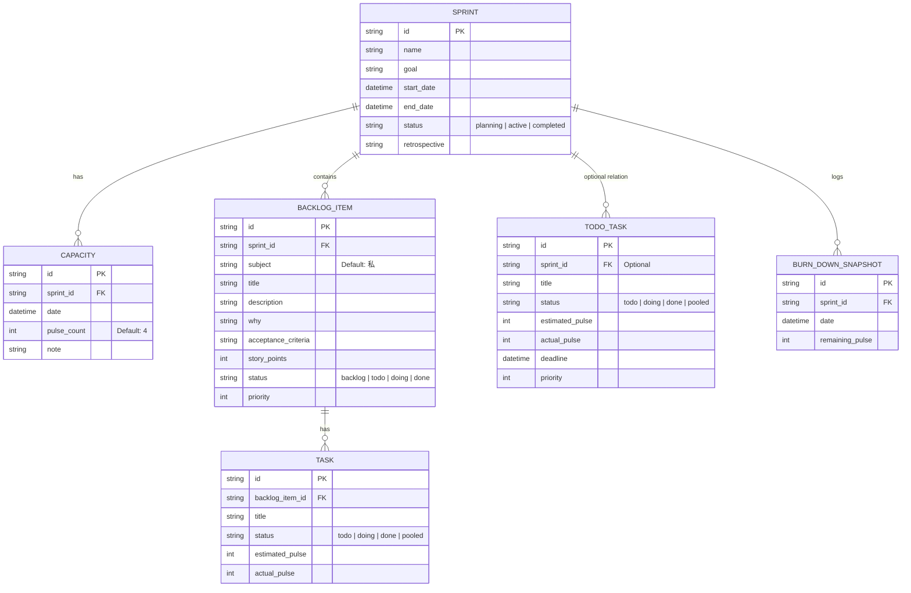

# データベース設計

OrbitPulse はデータベースに **SQLite** を、ORM に **Drizzle ORM** を使用しています。

## エンティティ図（論理構造）



## テーブル詳細

### sprints
スプリント（期間区切りの作業単位）を管理します。
- `status`: スプリントの状態を管理。`active` になると実行中。

### capacities
各日付ごとの作業可能量（パルス数）を管理します。
- 1パルス = 25分（ポモドーロ1回分相当）。

### backlog_items
プロダクトバックログ。ユーザーストーリーの形式（「誰が」「何を」「なぜ」）で定義されます。
- `why`: なぜこれが必要なのかを記述。本システムの重要な要素です。

### tasks
バックログアイテムを具体的に分解したタスク。
- `estimated_pulse`: 見積もりパルス数。
- `actual_pulse`: 実際に消化したパルス数。

### todo_tasks
スプリントバックログとは別に、日常的に発生する細かなタスク（雑務など）を管理します。

### burn_down_snapshots
バーンダウンチャートを描画するための履歴データ。

## マイグレーション

Drizzle Kit を使用しています。
```bash
# スキーマの変更を反映
npm run db:push
```
